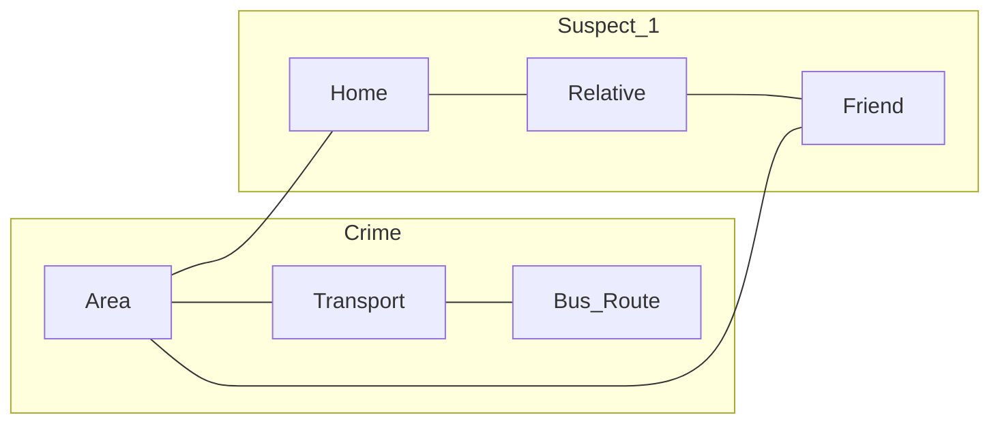

# Mermaid

## Example Graph DB Model (graph.md)

```mermaid

  graph LR
   subgraph Crime
   Area --- Transport
   Transport --- Bus_Route
   end
  
   subgraph Suspect_1
   Home --- Relative
   Relative --- Friend
   end
  
   Area --- Home
   Area --- Friend

```

