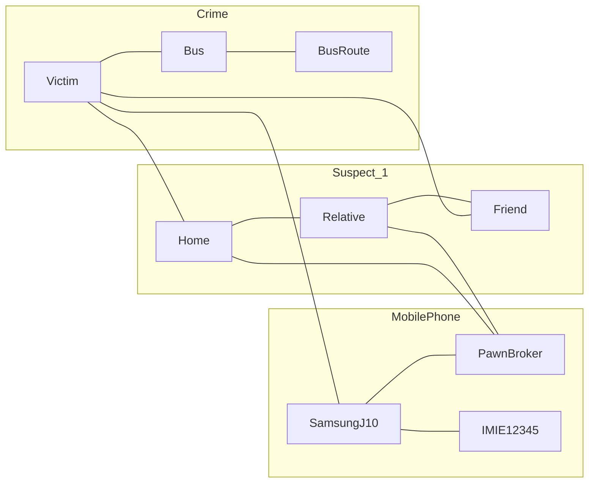

# Mermaid

## Example Graph DB Model (graph.md)
This models a very simple Graph Database for a crime, graph databases are often used in criminal investigation and security operations to reflect real world links between things and many example models reflect this.

These often follow what is called a POLE model:
* Person
* Object
* Location
* Event

That is something (event) happened somewhere (location) involving something (object) and one or more people (person).  In the below example a crime (event) happened to a victim (person) on a bus (location).  A suspect (person) has a home (location) that the victim is connected to, they also have a relative who has a friend who is connected to the victim.  Related to this crime was a mobile phone (object) with a specific IMEI number which belongs to the victim and was recovered from a pawnbroker near the the suspect's home which is connected to their relative.

