# Basic Markdown Examples

Markdown is a simple text formatting language similar to HTML or LaTeX, but trading reduced functionality for simplicity and a short learning curve\.  Markdown is quite similar to original HTML in intent, as a content creator you don't think about the details of the final appearence but leave that up to the user's device and the software they use.

Markdown has gained most traction in producing documentation for open source projects, in partiular on GitHub where each project is automatically created with a readme\.md (\.md is the file extension for a Markdown file) in it's root for documenting the project and offering guidance to potential users and contributors, and most user documentation is also produced in Markdown\.  Additonally, a number of note taking apps, such as Obsidian and Bear, use Markdown as their file storage format\.  This has the, no doubt unintended, benefit of if you stop using the app or are on a device where you can't access the app but can still access the files \(by default Obsidian and Bear store their files on iCloud\) you can still access the content.

Much like LaTeX a single carriage return does not start a new line in the output, unless you add two spaces to the end of the line or the new line starts with a control symbol\.

Markdown uses a set of reserved characters (control symbols) to provide formatting, if you need to use these characters in your text then you can escape 
them by putting a backslash \(\\\) in front of them\:
-  \\ backslash itself
-  \` backtick
-  \* asterisk
-  \_ underscore
-  \{ \} curly braces
-  \[  \] square brackets
-  \( \) parentheses
-  \# hash mark
-  \+ plus sign
-  \- minus sign (hyphen)
-  \. dot
-  \! exclamation mark

Some implementations of Markdown viewer will also render HTML tags, but others will not.

The main advantages of Markdown over WYSIWYG word processors such as Word or Pages include\:
-  Being plain text Markdown documents can be edited on pretty much any platform, including web based editors, where you can edit plain text \(files in this project have been created direct on GitHub, on a Windows 10 PC, a Windows 11 PC, a MacBook and an iPad\)
-  Being plain text the files are likley to be accessible long after propietary formats used in WYSIWYG wordprocessors have faded into history
-  Files tend to be smaller than the equivalent WYSIWYG files
-  If for some reason you don't have access to a Markdown viewer, the text is readable and formatting is mostly inferrable.
-  If part of a file gets corrupted the rest of the file is still readable
-  The format is extendable, for example Mermaid is an extention of Markdown that allows charts and images to be produced, so long as the viewers support the extention

Key disadvantages include\:
- Not as fully featured as most WYSIWYG workprocessors 
- A bit of learning curve to become competent, but less than say HTML or LaTeX
- Have to write your text with the control symbols then run the file through a viewer to see the effect, 
although plugins for common IDEs such as VS.Code and online editors often provide a preview pane
-  Can be a bit fussy about white\-space \(especially spaces after control sequences\)
-  May render slightly differently in different viewers, although it will still be comprehensible, a heading one will still visibly higher level than a heading two but how that is achieved may differ and you cannot dictate the viewer renders elements \(e.g. the font used or the style of bullet in a list\)

## Headings

To make a line of text a heading just start the line with a \#, Markdown supports 5 levels of heading, 
level 1 uses a single \# and each \# you add up to \#\#\#\#\# takes it down one level e.g.\;

```
# Heading 1 - \#
## Heading 2 - \#\#
### Heading 3 - \###
#### Heading 4 - \####
##### Heading 5 - \#####
```

# Heading 1 - \#
## Heading 2 - \#\#
### Heading 3 - \###
#### Heading 4 - \####
##### Heading 5 - \#####

## Emphasis

### Bold

To make text bold, enclose it in a pair of astrisks, \*\*, or underscores, \_\_\.

```
**The quick brown fox jumps over the lazy dog.**
__The quick brown fox jumps over the lazy dog.__
```

**The quick brown fox jumps over the lazy dog.**
__The quick brown fox jumps over the lazy dog.__
 
### Italic

To make text italic, enclose it in a single asterisk, \*, or underscore, \_\.

```
*The quick brown fox jumps over the lazy dog.*
_The quick brown fox jumps over the lazy dog._
```

*The quick brown fox jumps over the lazy dog.*
_The quick brown fox jumps over the lazy dog._


### Bold and Italic

You can combine both, \*\*\_ or \_\_\*, to get bold and italic text\.

```
**_The quick brown fox jumps over the lazy dog._**
```

**_The quick brown fox jumps over the lazy dog._**

### Strike-Through

To ~~strke-through~~ text just put it between two pairs of the tilde (\~) symbol, e.g. `~~strike-through~~`


## Tables

To crete a table start each row with a pipe-symbol, \|, then divide the columns with a pipe-symbol.

e.g. \| Col1 \| Col2 \| Col3 \|

To control the alignment of items in a table you can create the **second row** of the table with flags showing how that column should be displayed\:
-  Default Alignment \- \-
-  Left Alignment \- \:\-
-  Centre Alignment \- \:\-\:
-  Right Alignment \- \-\:

```
| Default | Left align | Center align | Right align |
| - | :- | :-: | -: |
| 9999999999 | 9999999999 | 9999999999 | 9999999999 |
| 999999999 | 999999999 | 999999999 | 999999999 |
| 99999999 | 99999999 | 99999999 | 99999999 |
| 9999999 | 9999999 | 9999999 | 9999999 |
```


| Default | Left align | Center align | Right align |
| - | :- | :-: | -: |
| 9999999999 | 9999999999 | 9999999999 | 9999999999 |
| 999999999 | 999999999 | 999999999 | 999999999 |
| 99999999 | 99999999 | 99999999 | 99999999 |
| 9999999 | 9999999 | 9999999 | 9999999 |

## Block Quotes

To include text as a block quote \(e.g. a block of text from a document or communication\), start each line with a greater than symbol, />\.

e.g. \:
```
\> This text is blockquoted  
\>\> This text if blockquoted two levels
```

> This text is blockquoted
>> This text if blockquoted two levels

## Lists

### Unordered List

An unordered \(bulleted\) list can be created by starting each line in the list with a hyphen, \-, if the list has multiple levels 
\(some list items break down into further detail) this can be achieved by indenting the detail items.  Depending on the Markdown 
viewer used the detail items may use a visually different bullet but it is not possoble to control what is used, e.g.\:

```
- first item
- second item  
  - detail of second item. 
  - etc  
- third item
```

- first item
- second item
  - detail of second item
  - etc
- third item

### Ordered List

An ordered \(numbered\) list can be created by starting each item with a digit, 0 to 9, followed by a full stop, \., or closing parenthesis.  
The 0 to 9 limit, giving a maximum of 10 items per ordered list, is as a result of problems with integer overflow errors in some Markdown viewers.

e.g.

```
1. First item
2. Second item
3. Third item
```

1. First item
2. Second item
3. Third item

or

0) Item zero
1) Item one
2) Item two
3) Item 3

or even

```
1. First item
1. Second item
1. Third item
```
1. First item
1. Second item
1. Third item

In this last case the items will automatically renumber if the order changes or an item is added or removed.

If you need more than 10 items in a list then consider looking at how to split the list into smaller chunks or combining items.  It is worth
bearing in mind that, from a User Experience \(often abbreviaed to UX\) perspective, long monolithic lists can be overwhelming.  Dividing the list into 
logically separate chunks, e.g. if the list is a process that someone must follow then perhaps breaking when they switch tool or submit a screen or form,
can make it easier to follow\.  Even lists such as scores in sporting or academic competitions can be most easily under stood if broken into top 10, 
next 10 and so on\.

## Code Highlighting

### Inline Code

To include program code, also works for mathematical formulas (although Markdown doesn't have the abilituy to represent maths that LaTeX does),
enclose it between a backtick \(also called a backquote\), \`.

e.g. This is some \`code\`

This is some `code`

### Code Block

To include a block of code, e.g. a fragment of a script, commands that you want a user to enter as is or something that you don't want the Markdown viewer to interpret, enclose the block between two lines that just contain three backticks \(\`\`\`), e.g.

````
```
Some code
Next line of code
```
````

```
Some code
Next line of code
```
The three backticks is called a rail or fence and can be used to tell the Markdown viewer that a chunk of code should be rendered in a particular way.  This can be used to include code that uses an extended syntax such as Mermaid diagrams.

For example if you just insert a chunk of Mermaid without rails then you get:


graph LR
  subgraph N
  a --- b
  b --- c
  end

  subgraph M
  d --- e
  e --- f
  end

  a --- d
  a --- e


which is a mess, with just the bare fences:

```
graph LR
  subgraph N
  a --- b
  b --- c
  end

  subgraph M
  d --- e
  e --- f
  end

  a --- d
  a --- e
```

which shows you the Mermaid code, and specifying Mermaid with \`\`\`mermaid\:

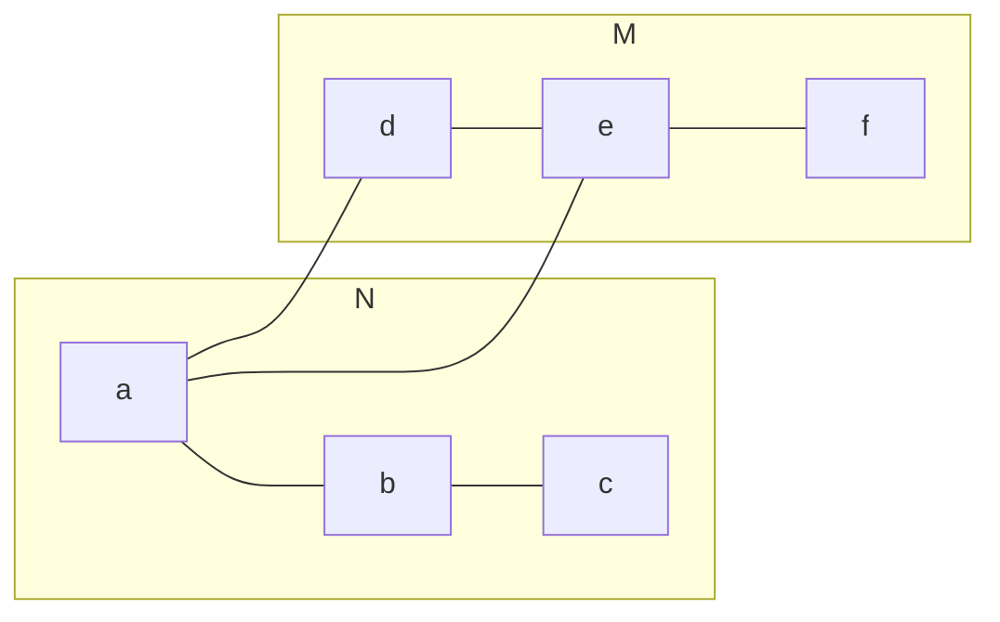

to render the diagram\.

### Diagrams \(Mermaid\)

A variety of basic diagrams can be produced in Markdown through the use of the **Markdown** extension to the language.  Some Markdown editors and viewers (such as the one built into Github) have Mermaid support built in whilst others \(e.g. VS.code\) will require a plugin\.  If the diagram is required for a non-Markdown document then you may wish to use the online Mermaid editior Mermaid.Live \(https://mermaid.live/\) and export to a graphic using Kroki \(via a button in the *Actions* panel\).  

Examples of Mermaid diagrams include:
#### Graph

A graph database stores descriptions of *entities* and the *relationships* between them\.  The below gives a diagram with an example of a crime investigation graph based on POLE (Person-Object-Location-Event) model\.
````
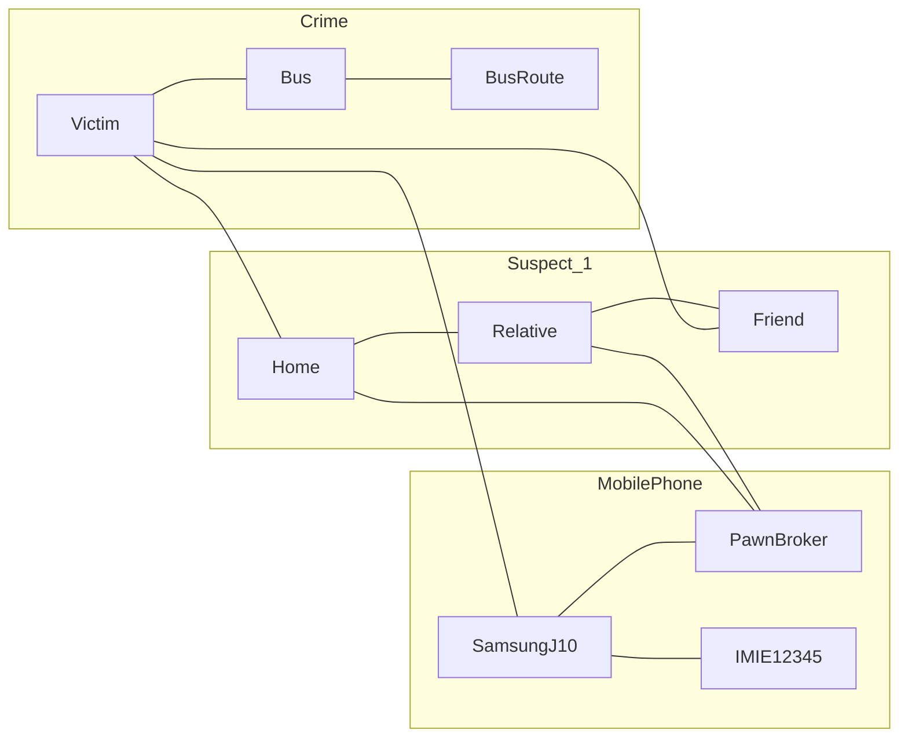
````


Note that if using the Mermaid.Live editor you should leave off the the rails.

#### User Journey

User Journeys are commonly used in Agile to give a high level overview of a process from the perspective of the user, typically including how the user feels at each point to identify pain points.  The below gives a, somewhat tongue in cheek, example of the user journey for getting PRINCE2 qualified\.

````
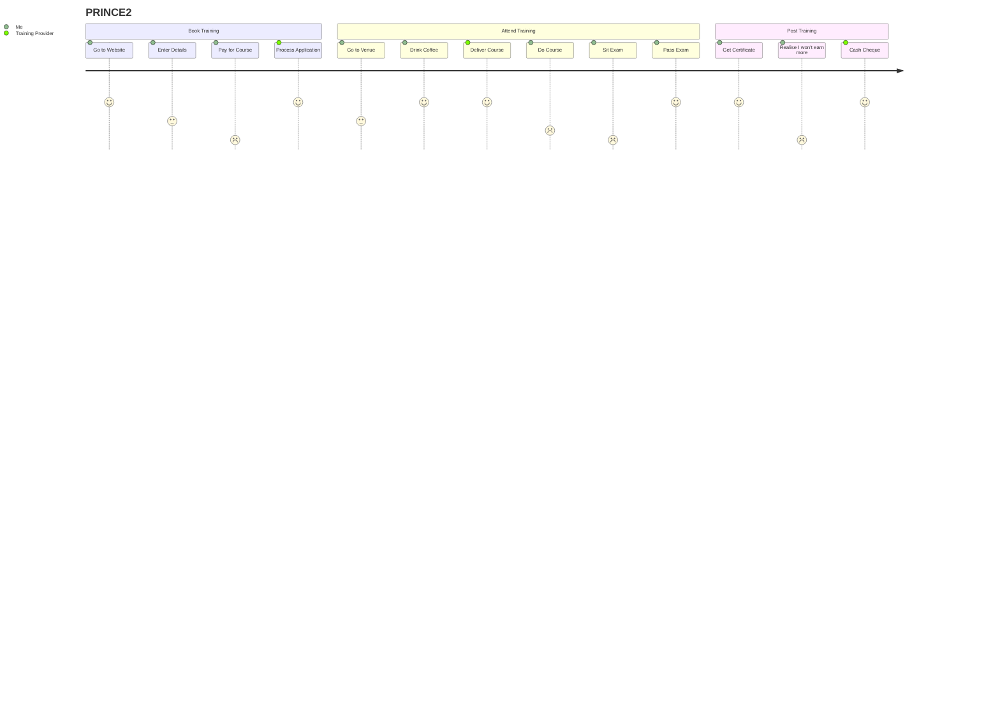
````


#### Sequence Diagram

High level overview of a process as a set of interactions between two or more actors.  As these can be viewed as a conversation, the first example shows a conversation between two people:

````
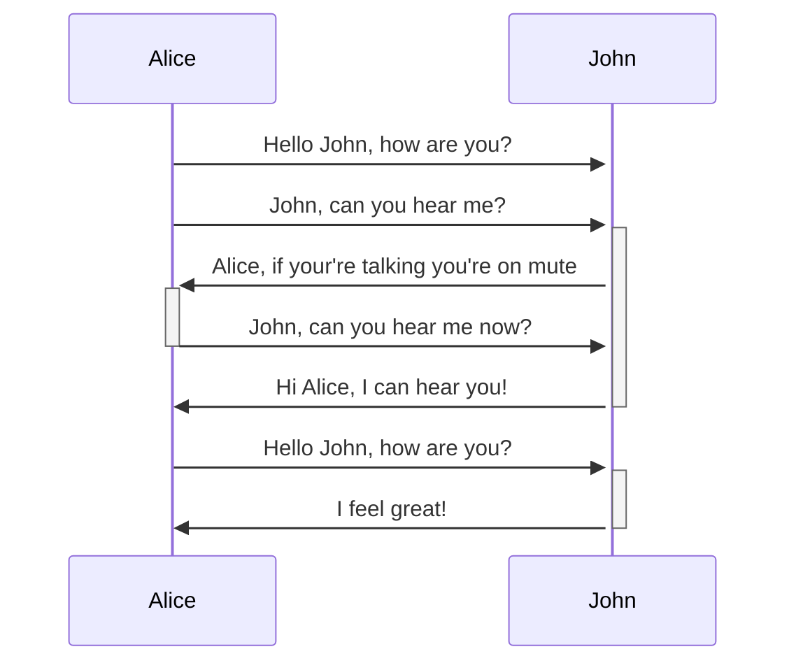
````


This second example shows a, simplified, interaction between a customer, an Automated Teller Machine (aka a Cashpoint) and the backend systems at a bank (Accounts).

````
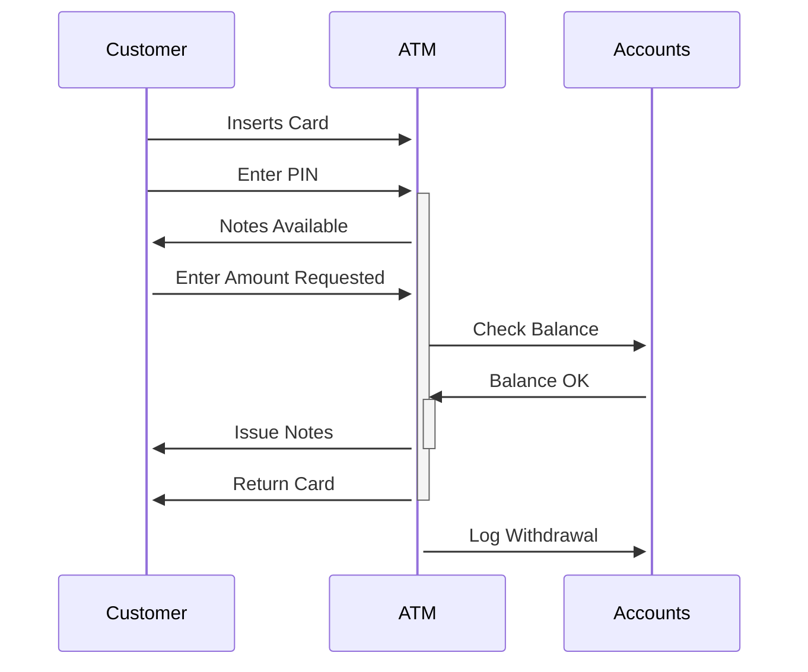
````


#### Flowcart

Flow charts show a more detailed view of a process, breaking a process down to the individual steps.  This example shows the proper procedure for making a cup of tea

````
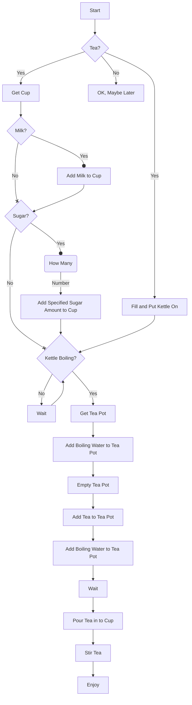
````


#### Class Diagrams

Class diagrams are a type of UML diagram that describes classes in Object-Oriented Programming.  The below describes a simplified fragment of a HR system with a superclass Employee and two subclasses, Manager and Salesperson.  Each class has a name, a list of attributes (variables) and a list of methods (functions).  An object of class Employee has all of the attributes and methods of the Employee class but not of the Manager or Salesperson classes.  An object of the class Manager inherits the attributes and methods of the Employee class and additionally has those of the Manager class but not those the Salesperson class.  Similarly an object of the Salesperson class inherits the attributes and methods of the Employee class and additionally has those of Salesperson class but not of the Manager class.

````
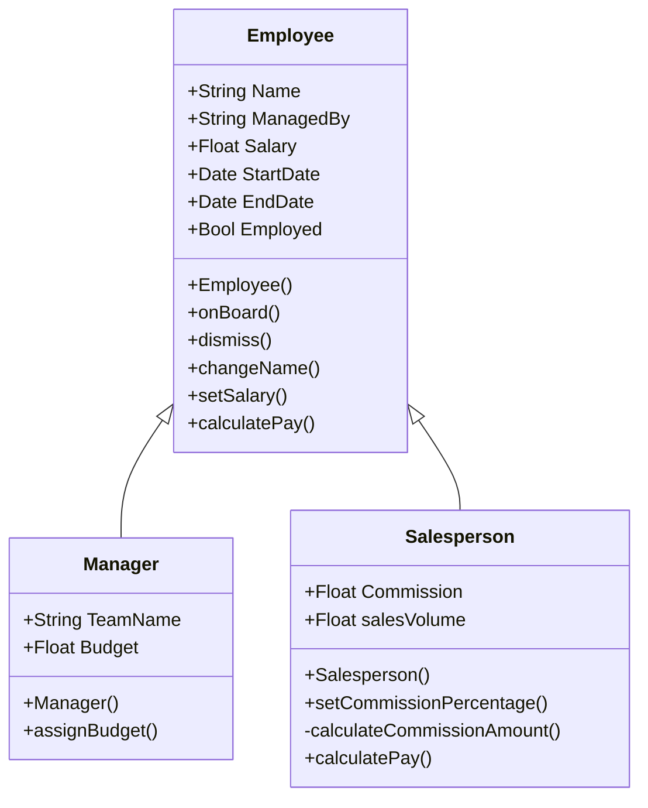
````


You may notice that both the Employee and Salesperson classes have a method called calculatePay().  This is an example of overloading, for a Salesperson object the Salesperson.calculatePay() method overrides the one inherited from Employee.  This might be used because an employee gets a basic salary so the Employee.calculatePay() method just uses the Salary attribute to calculate the pay whilst a salesperson get commission on their sales so Salesperson.calculatePay() uses the salary and the commission earned (possibly using a call to calculateCommissionAmount() which uses the Commission and salesVolume attributes to calculate the commmission earned) to calculate the pay.

#### Entity Relationship Diagram

An entity relationship diagram is commonly used in the design of databases to show the relationship between the data entities (typically the representation of real work objects and events).  In this example\:
- Each department employes one or more employees, each employee is employed in one and only one department
- Each role is fulfilled by zero or more employees, each employee fulfils one or more roles
- Each post is held by zero or 1 employees, each employee holds one and only one post
- Each post is funded by one and only one budgets, each budget funds one or more posts
- Each role is delivered by one or more posts, each post delivers one or more roles
- Each employee manages zero or more other employees, each employee is managed by one and only one other employee
- Each department provides 1 or more services, each service is delivered by one and only one departments

````
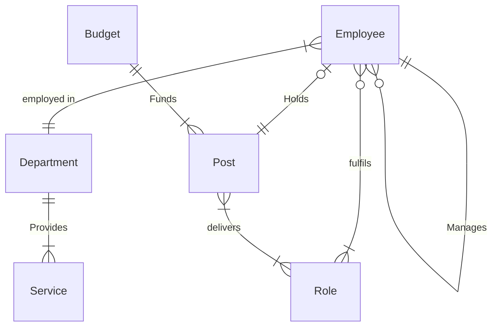
````


#### State Diagram

````
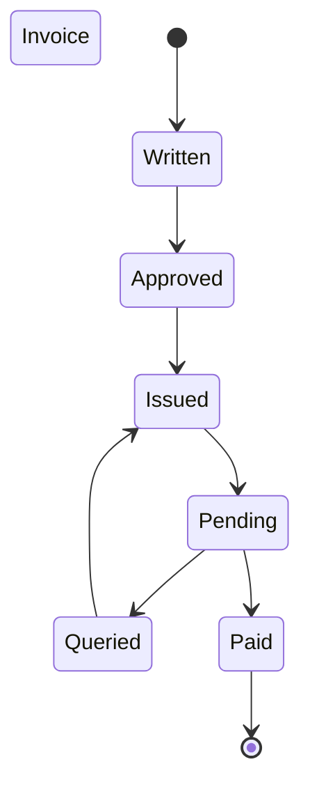
````


#### Context Diagram

A context diagram describes at a very high level the relationships a system has to other systems and to human entities (Actors), which may be users or people who are impacted someway by the system.  Context diagrams are sometimes confused with Use Case diagrams and Data Flow diagrams, but differ in key ways.  Use Case disagrams are concerned with what the systems does as a result of the interaction with the Actor/other System but Context Diagrams are only concerned with which Actors/other systems the system interacts with and the task they perform.  Data Flow diagrams are concerned with what data flows between Acrors/Systems but Context Diagrams are only concerned that data does flow between Actors/Systems.  Context Diagrams could be considered an executive summary of Use Case and Data Flow diagrams.  This example gives an overview of a room booking process where bookings can be made by a Hotel Clerk or a propective Hotel Guest via the room booking system.  In either case the guest's credit card details are taken and their card charged via a bank.

````
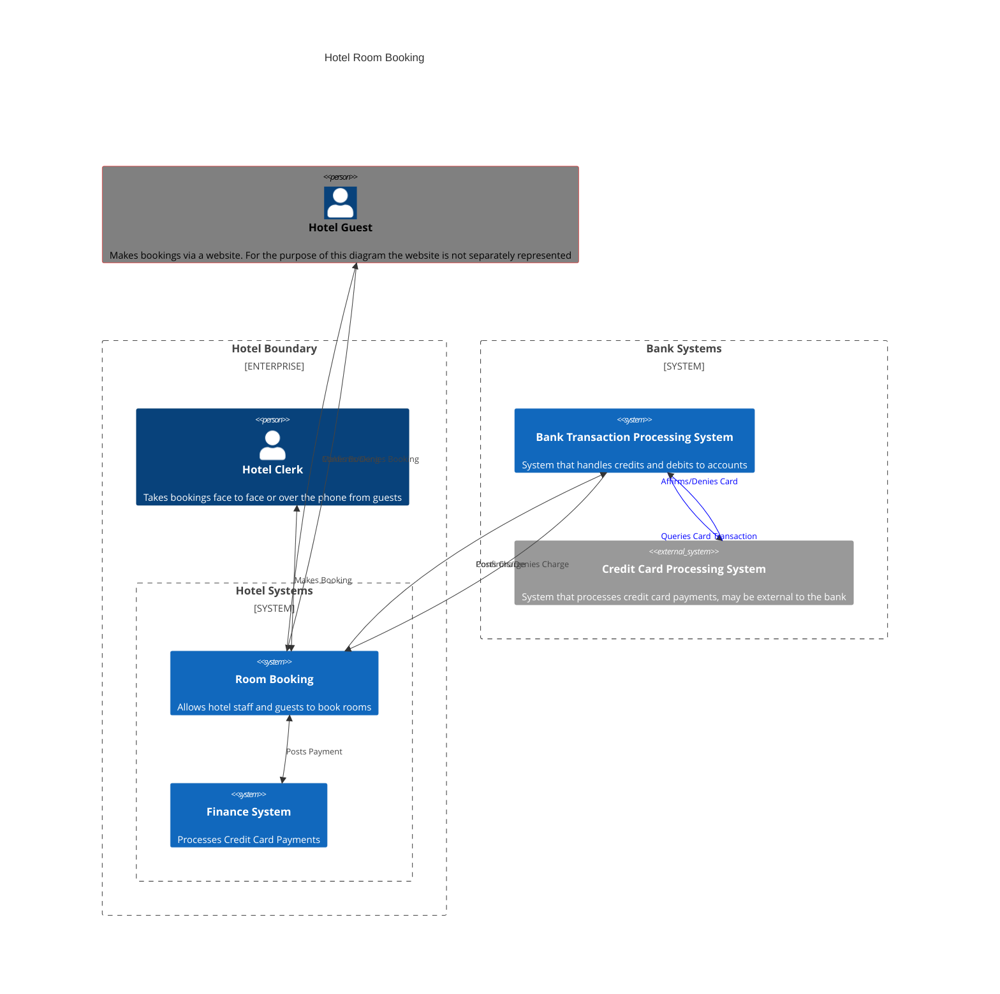
````


#### Pie Charts
Simple 2D pie charts can be created.

````
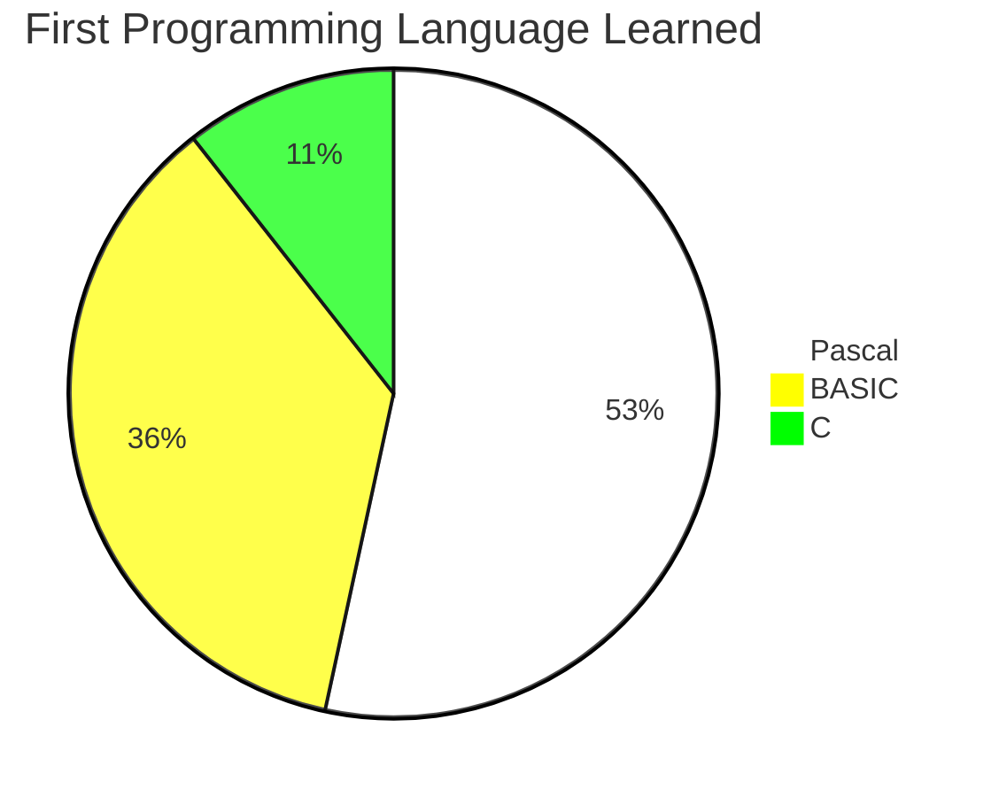
````

```mermaid
pie title First Programming Language Learned
%%{init: {'theme': 'base', 'themeVariables': { 'pie1': '#FFFFFF', 'pie2': '#FFFF00', 'pie3': '#00FF00', 'pie4': '#0000FF', 'pie5': '#800080', 'pie6': '#ff0000', 'pie7': '#FFA500'}}}%%
    "Pascal" : 126
    "BASIC" : 85
    "C" : 25
```

Note that pie charts are often shunned in serious data analysis due to issues of interpretation.  Humans are poor at interpreting the comparative difference between angles and tend to interpret based on area so may weight areas more heavily than they should.  For example in the example above the figure for Pascal is close to 1.5 times that for BASIC but an intial impression may be that the difference is greater than that.

#### Requirements Diagram

```mermaid
    requirementDiagram
requirement test_req {
    id: 1
    text: the test text.
    risk: high
    verifymethod: test
    }
functionalRequirement test_req2 {
    id: 1.1
    text: the second test text.
    risk: low
    verifymethod: inspection
    }
performanceRequirement test_req3 {
    id: 1.2
    text: the third test text.
    risk: medium
    verifymethod: demonstration
    }
interfaceRequirement test_req4 {
    id: 1.2.1
    text: the fourth test text.
    risk: medium
    verifymethod: analysis
    }
physicalRequirement test_req5 {
    id: 1.2.2
    text: the fifth test text.
    risk: medium
    verifymethod: analysis
    }
designConstraint test_req6 {
    id: 1.2.3
    text: the sixth test text.
    risk: medium
    verifymethod: analysis
    }
element test_entity {
    type: simulation
    }
element test_entity2 {
    type: word doc
    docRef: reqs/test_entity
    }
element test_entity3 {
    type: "test suite"
    docRef: github.com/all_the_tests
    }
test_entity - satisfies -> test_req2
    test_req - traces -> test_req2
    test_req - contains -> test_req3
    test_req3 - contains -> test_req4
    test_req4 - derives -> test_req5
    test_req5 - refines -> test_req6
    test_entity3 - verifies -> test_req5
    test_req <- copies - test_entity2
```

#### Mindmap

````
```mermaid
mindmap
	root((Parking Charges))
    ::icon(fa fa-car)
		Penalty Charge Notice
			Issued by Police or Local Council
			Legally Enforeable
                Based in Law 
					Terms and Conditions Presumed
                    ::icon(fa fa-book)
				Can result in points
                ::icon(fa fa-id-card)
			Can be Appealed at Arbitration
				Approximately 70\% are Overturned at Appeal
		Parking Charge Notice
			Issued By Private Company
			Have to Sue to Enforce
				Technically a Contract Violation
			Based in Displayed Terms and Conditions
				Terms and Conditions Must Be Visible
			Can be Appealed to Issuer or at Arbitration
				Approximately 94% are Overturned at Arbitration
```
````

**GitHub does not render mindmap Mermaid.  To see this mindmap rendered, copy and paste into https://mermaid.live/**

The icons shown beign used here are from a service called Font Awesome (https://fontawesome.com/v4/icons/), support varies between viewers.
